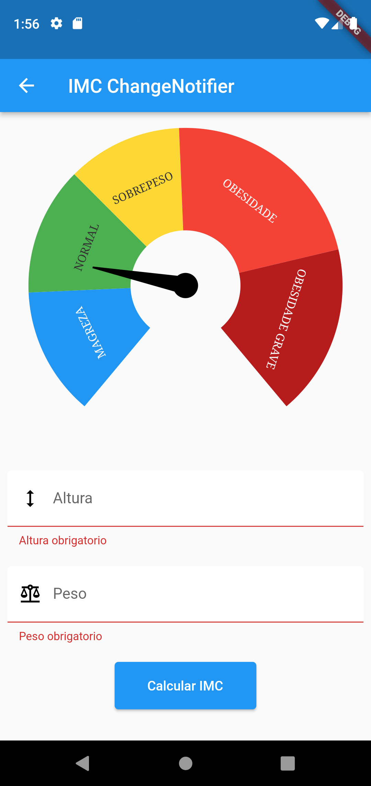

# Flutter State Maneger

Repositório criado para mostrar as diferentes maneiras de criar um teste IMC. Usando os gerenciadores de estados setstate, change_notifier, value_notifier e bloc.

## Interface do sistema

 
   
 

## Support e Referência
Referencia: Academia do Flutter

Você pode obter suporte da comunidade por meio de:

